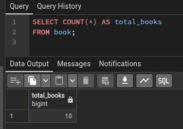
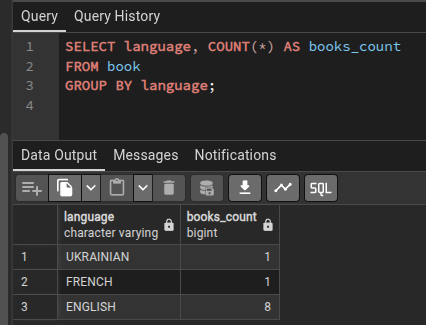
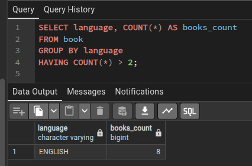
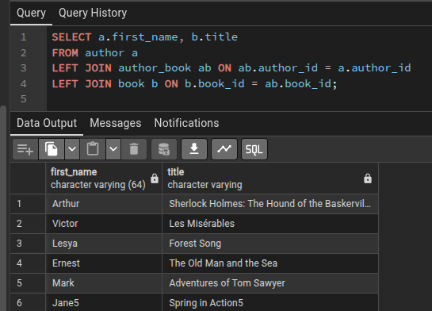
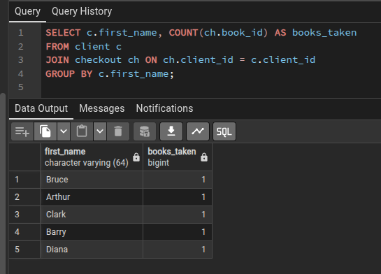

# Лабораторна робота 4

## Ось приклади деяких запитів:

- Підрахувати кількість книг у базі.
 

 
- Знайти кількість книг для кожної мови.
 

 
- Показати лише ті мови, у яких більше ніж 2 книги.
 

 
- Показати книги та їхніх видавців
 

 
- Показати всіх авторів і книги, навіть якщо автор не написав жодної
 

 
- Знайти, скільки книг взяв кожний клієнт.
 
