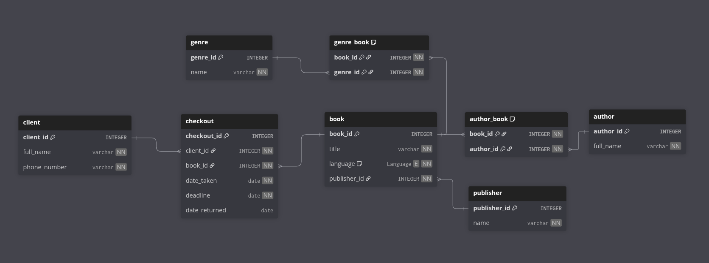

# Звіт з нормалізації — Лабораторна робота 5

---

## 0. Початкова схема

```text
Enum Language {
  English
  Ukrainian
  French
}

Table client {
  client_id integer [primary key]
  full_name varchar [not null]
  phone_number varchar [not null, unique]
}

Table checkout {
  checkout_id integer [primary key]
  client_id integer [ref: > client.client_id]
  book_id integer [ref: > book.book_id]
  date_taken date [not null]
  deadline date [not null]
  date_returned date
}

Table book {
  book_id integer [primary key]
  title varchar [not null]
  language Language [not null]
  publisher varchar [not null]
}

Table author {
  author_id integer [primary key]
  full_name varchar [not null]
}

Table genre {
  genre_id integer [primary key]
  name varchar [not null, unique]
}

Table genre_book {
  book_id integer [ref: > book.book_id]
  genre_id integer [ref: > genre.genre_id]
  indexes {
    (book_id, genre_id) [pk]
  }
}

Table author_book {
  book_id integer [ref: > book.book_id]
  author_id integer [ref: > author.author_id]
  indexes {
    (book_id, author_id) [pk]
  }
}
```

У `book.publisher` зберігається назва видавництва як звичайний рядок, це змушує зберігати багато повторюваної інформації і порушує 3НФ.

---

## 1. Функціональні залежності для початкової схеми

### client

* `client_id -> full_name, phone_number`
* `phone_number -> client_id, full_name` (бо phone_number має UNIQUE)

### book

* `book_id -> title, language, publisher`

### author

* `author_id -> full_name`

### genre

* `genre_id -> name`
* `name -> genre_id` (бо name UNIQUE)

### checkout

* `checkout_id -> client_id, book_id, date_taken, deadline, date_returned`

### author_book, genre_book

* У цих таблицях ключі складені (`book_id, author_id` і `book_id, genre_id`) і немає неключових атрибутів, тому інших ФЗ нема `(book_id, author_id) -> ∅`, `(book_id, genre_id) -> ∅`.

---

## 2. Аналіз нормальних форм для початкової схеми

### 1NF

* Усі поля атомарні (немає списків або повторюваних колонок). Тому 1NF — виконана.

### 2NF

* Часткова залежність можлива лише при складеному PK. `author_book` і `genre_book` мають складені PK, але **не містять додаткових неключових атрибутів**, отже часткових залежностей немає. 2NF — виконана.

### 3NF

* Основна потенційна проблема: `book.publisher` — назва видавництва, яка може повторюватись у багатьох рядках. Якщо з'являться додаткові атрибути видавництва (`address`, `website`), то вони будуть транзитивно залежні від `book_id` через `publisher`.

Отже початкова схема в поточному вигляді близька до 3NF, але має **потенційну транзитивну залежність** через publisher — тому треба виділити видавництво в окрему таблицю.

---
## 3. SQL-інструкції для перетворення заповненої бази

Створити таблицю publisher і перенести унікальні значення


<br>
<br>

Додати колонку publisher_id у book та заповнити її


<br>
<br>

Перевірки та накладання обмежень


## 5. Повний набір CREATE TABLE для фінальної  схеми

```sql
CREATE TABLE publisher (
  publisher_id SERIAL PRIMARY KEY,
  name VARCHAR NOT NULL UNIQUE
);

CREATE TABLE book (
  book_id SERIAL PRIMARY KEY,
  title VARCHAR NOT NULL,
  language VARCHAR NOT NULL,
  publisher_id INTEGER NOT NULL REFERENCES publisher(publisher_id)
);

CREATE TABLE client (
  client_id SERIAL PRIMARY KEY,
  full_name VARCHAR NOT NULL,
  phone_number VARCHAR NOT NULL UNIQUE
);

CREATE TABLE author (
  author_id SERIAL PRIMARY KEY,
  full_name VARCHAR NOT NULL
);

CREATE TABLE genre (
  genre_id SERIAL PRIMARY KEY,
  name VARCHAR NOT NULL UNIQUE
);

CREATE TABLE author_book (
  book_id INTEGER REFERENCES book(book_id),
  author_id INTEGER REFERENCES author(author_id),
  PRIMARY KEY (book_id, author_id)
);

CREATE TABLE genre_book (
  book_id INTEGER REFERENCES book(book_id),
  genre_id INTEGER REFERENCES genre(genre_id),
  PRIMARY KEY (book_id, genre_id)
);

CREATE TABLE checkout (
  checkout_id SERIAL PRIMARY KEY,
  client_id INTEGER REFERENCES client(client_id),
  book_id INTEGER REFERENCES book(book_id),
  date_taken DATE NOT NULL,
  deadline DATE NOT NULL,
  date_returned DATE
);

CREATE TYPE language AS ENUM ('English', 'Ukrainian', 'French');
```
---
Було:

<br>
Стало:

